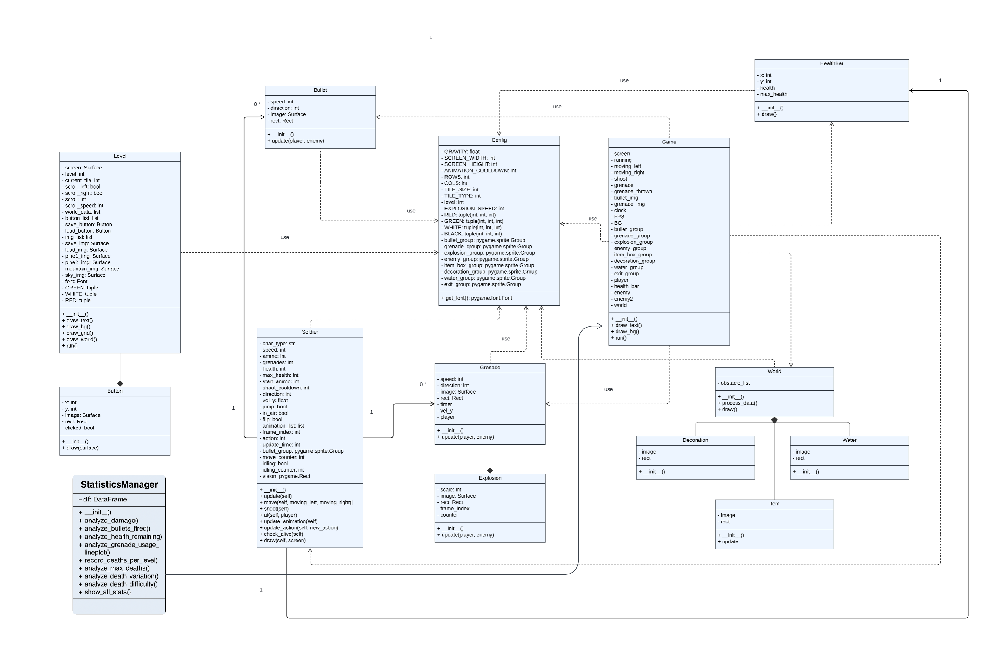

# Side-Scrolling-Shooter

This project is a side-scrolling shooter game where players control a character navigating through different levels while eliminating enemies, avoiding obstacles, and collecting power-ups. The game will include smooth movement mechanics, responsive shooting controls, dynamic enemy behavior, and a scoring system.

---

## Description

The Side-Scrolling Shooter is an action-packed 2D game where players control a heavily armed character navigating through enemy-infested environments. The game challenges players to defeat waves of enemies, avoid obstacles, and collect power-ups while progressing through levels of increasing difficulty.

---

## Main Features

- Player Movement: The character moves left or right, jumps over obstacles, and crouches to dodge attacks.
- Shooting System: The player can fire in multiple directions and has different weapons with limited ammunition.
- Enemy AI: Various enemy types with different attack patterns, such as ranged shooters, melee attackers, and flying drones.
- Health System: The player has a limited health pool and can pick up health packs to restore lost HP.
- Power-ups & Upgrades: Players can collect special items, such as weapon upgrades, speed boosts, and temporary invincibility.

---

## UML Diagram



---

## 🧪 How to Installation & Run

1. **Install Dependencies**: Make sure you have Python installed on your system. You will need to install the following Python packages:
    ```bash
    pip install -r requirements.txt
    ```

2. **Download the Repository**: Clone or download the repository to your local machine.
    ```bash
    git clone https://github.com/Kantapon2547/Side-Scrolling-Shooter.git
    ```

3. **Prepare Data**: Ensure you have the following CSV files in the project directory:
   - `level_1_.csv`: Contains data for level 1 of a game or application.
   - `level_2_.csv`: Contains data for level 2 of a game or application.
   - `level_3_.csv`: Contains data for level 3 of a game or application.
   - `data_collection.csv` : If it has a problem running the data visualization part, you can check it in a .csv file. 

4. **Run the Application**: Open a terminal or command prompt, navigate to the project directory, and run the following command:
    ```bash
    python main_game.py 
    ```

5. **Exit the Application**: Close the application window when done.

---

## 🎮 How to Play
### Movement Controls:

A : Move left

D : Move right

W : Jump

### Combat Controls:

Spacebar: Shoot

Q : Grenades Thrown

---

## 🎮 Game Asset Credits

### 🎨 Visual Assets

- **Grenades & Icons**  
  [mtk – Grenades 16x16](https://mtk.itch.io/grenades-16x16)

- **Pixel Art Backgrounds & UI Elements**  
  [Eray Zesen – Pixel Platformer Pack](https://erayzesen.itch.io/pixel-platf...)

- **Character & Environment Art**  
  [Secret Hideout – Team War Assets](https://secrethideout.itch.io/team-wa...)

### 🔊 Audio Assets

- **Bullet Whiz Sound Effect**  
  [SoundBible – Bullet Whiz](https://soundbible.com/1875-Bullet-Whiz.html)

- **Background Music (Fantasy Theme)**  
  [SoundImage.org – Fantasy Wonder](https://soundimage.org/fantasywonder/)

### 🧱 Code

- GitHub Repository: [russs123/LevelEditor](https://github.com/russs123/LevelEditor)

- GitHub Repository: [russs123/Shooter](https://github.com/russs123/Shooter)

---

Homepage : https://github.com/Kantapon2547/Side-Scrolling-Shooter

Proposal : https://docs.google.com/document/d/1RiRdjHtJnhVv64oHVYXSg3_lE3hYz9SE_svdG26-tgs/edit?usp=sharing